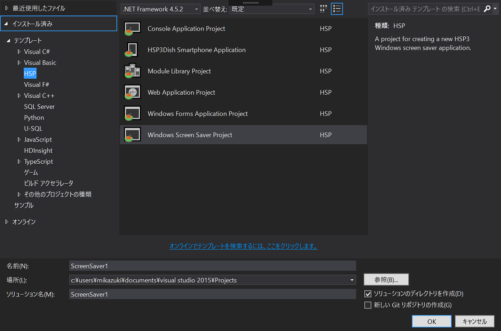

HSP Tools for Visual Studio
----
HSP Tools for Visual Studio (HSPToolsVS) add HSP language service to your Visual Studio. 

## Features
HSPToolsVS provide below features.  

### Create and Manage Projects
  
Create new projects and manage projects on Visual Studio.  
Supported types is ...

* Windows From (Normal HSP Project)
* Console (use "hsp3cl" runtime)
* Screen Saver (use packopt type "2")
* Module (Normal HSP Project for Libraries)
* HSP3Dish (iOS, Android, Web)

 
### Syntax Highlighting
   
Syntax highlighting for HSP files (`*.hsp`, `*.as`).  
Support HSP3 System Functions, Macros, Preprocessors, Flags, Strings, Comments and Numerics.

 
### IntelliSense
  
IntelliSense support.  
`rs` is matching to `rsize` and `genRandomString`.  
Matching condition is written in `HSPAuthoringScope.GetWordCandidatesFromIdentifier`.